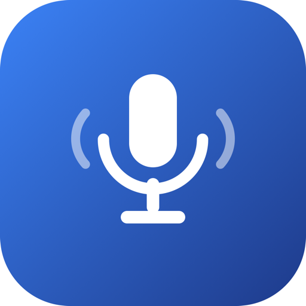

<div align="center">
  

  # MeetScribe

  macOS 向けリアルタイム会議文字起こし & Copilot。

  [](LICENSE)
  [](https://github.com/yuyuyupoke/meetscribe/releases)
  [](https://www.apple.com/macos/)
  [](https://swift.org/)

  [機能](#features) · [インストール](#install) · [使い方](#usage) · [アーキテクチャ](#architecture) · [ドキュメント](docs/)
</div>

---

MeetScribe は、マイク音声とシステム音声を並列で文字起こしし、右カラムの Copilot パネルが会議の全体像とキャッチアップ要約を自動で提示する、macOS ネイティブのフローティングパネルアプリ。会議に別のボットを呼ばずに、静かな副操縦士が欲しいときのために設計されている。

## Features

- **選べるAIプロバイダー** — OpenAI / xAIを設定画面で切り替え。文字起こし・整形・翻訳・Copilotを会議単位で同じプロバイダーへ統一。
- **デュアルストリーム文字起こし** — マイクとシステム音声を独立にキャプチャし、OpenAI `gpt-realtime-whisper` または xAI Grok Speech to Textへ話者ラベル付きでストリーミング。
- **インライン整形・翻訳** — OpenAI選択時は`gpt-4.1-mini`、xAI選択時は`grok-4.3`でフィラー除去・言い直し統合・日本語対訳を生成。
- **Copilot パネル** — ボタン押下で直近 1/3/5/10 分の発話を日本語で要約する「Catchup」と、発話量・経過時間トリガーで自動更新される「全体像」（目的・議題・現在地）。
- **自動タイトル生成** — 停止時に選択中のAIが会議タイトルを生成し、`YYYY-MM-DD_HH-mm_<title>.md` として保存。
- **フローティングパネル** — 常に最前面、サイズ可変、画面共有から非表示（ステルスウィンドウ）。
- **エコーキャンセル** — Voice Processing（AEC + AGC + ノイズ抑制）でオンライン会議での二重キャプチャを防止。
- **低オーバーヘッド** — VU メータと権限チェックをスロットリングし、終日利用に耐える設計。

## Requirements

| | |
|---|---|
| OS | macOS 14 (Sonoma) 以降 |
| AI API | OpenAI（`gpt-realtime-whisper` + `gpt-4.1-mini`）またはxAI（Grok Speech to Text + `grok-4.3`）のAPIキー。両方登録してGUIで切り替え可能 |
| 権限 | マイク、画面収録 |

文字起こし・整形・要約・議事録タイトルの生成はすべて、あなたが設定したAPIキーで直接
OpenAI または xAI に送信されます。開発者のサーバーは存在せず、会議のデータが開発者に
渡ることはありません。詳細は [PRIVACY.md](PRIVACY.md) を参照してください。

コスト目安: xAI Streaming STTは音声1時間あたり$0.20なので、30分会議を2ストリームで処理した文字起こし費は最大約$0.20。OpenAIは現行品質・互換性を優先して`gpt-realtime-whisper`を維持する。いずれも整形・翻訳・Copilotのテキストトークン料金は別途発生する。

## Install

> **AI にセットアップを任せる場合**: このリポジトリを clone し、Claude Code などの
> AI エージェントに「[SETUP.md](SETUP.md) を読んでセットアップして」と依頼するだけで、
> ビルドから権限設定・API キー登録まで対話的に完了できます。

[Releases](https://github.com/yuyuyupoke/meetscribe/releases) から最新の DMG をダウンロードする。

1. `MeetScribe-*.dmg` をダブルクリックしてマウント
2. `MeetScribe.app` を `Applications` フォルダへドラッグ
3. `Applications` から MeetScribe を起動

**初回起動時に「開発元を確認できないため開けません」と表示された場合**

MeetScribe は Apple の有料 Developer Program に加入していない個人開発アプリのため、
公証（notarization）を受けていません。そのため初回のみ macOS が起動をブロックします。
次の手順で許可してください（macOS 15 Sequoia 以降）。

1. 一度アプリを起動して、ブロックのダイアログを閉じる
2. **システム設定 → プライバシーとセキュリティ** を開く
3. 下にスクロールし「"MeetScribe" は開発元を確認できないため…」の横の **「このまま開く」** をクリック
4. Touch ID またはパスワードで承認する

> 手順3のボタンは、アプリの起動を試みてから**約1時間だけ**表示されます。見当たらない場合は、
> もう一度アプリを起動してから設定を開き直してください。
>
> macOS 14 以前では、`Applications` 内のアプリを右クリック →「開く」でも許可できます
> （この方法は macOS 15 以降では使えません）。
>
> それでも開けない場合は、ダウンロード時に付与された検疫属性を手動で外してください。
>
> ```bash
> xattr -cr "/Applications/MeetScribe.app"
> open "/Applications/MeetScribe.app"
> ```

セキュリティが気になる場合は、次のセクションのとおりソースからビルドしてください。

もしくはソースからビルド。

```bash
git clone https://github.com/yuyuyupoke/meetscribe.git
cd meetscribe
./scripts/setup-signing.sh
./build.sh
```

## Usage

初回起動時に、データの取り扱いについての説明が表示される。内容を確認して同意すると録音が使えるようになる。

その後、AIプロバイダーを選び、APIキーと議事録の出力フォルダを設定する。OpenAI/xAIのキーは別々にKeychainへ保存され、フッターの設定からいつでも追加・変更できる。

**会議を録音する**

録音ボタンをクリック。マイクとシステム音声が並列にストリーミングされ、それぞれ `[self]` / `[other]` とラベル付けされる。停止すると自動でタイトルが生成され、Markdown として出力フォルダにエクスポートされる。

**Copilot パネルを使う**

右パネルは録音中、自動で「全体像」（目的・議題・現在地）を更新し続ける。加えて下部の 1/3/5/10 分ボタンを押すと、その期間の発話を日本語で要約した「Catchup」カードが追加される。

| 操作 | 挙動 |
|---|---|
| 何もしない | 発話が一定量溜まる、または一定時間経過するたびに全体像が自動更新される |
| Catchup ボタン（1/3/5/10分） | 押した時点から遡ったN分間の発話を要約してカード表示 |
| 発話ゼロの期間で Catchup | LLM を呼ばず「この期間の発話はありません」と即時表示（課金なし） |

**バックグラウンドエージェントとして実行する**

```bash
sed "s|\$HOME|$HOME|g" config/com.meetscribe.agent.plist \
  > ~/Library/LaunchAgents/com.meetscribe.agent.plist
launchctl bootstrap "gui/$(id -u)" ~/Library/LaunchAgents/com.meetscribe.agent.plist
```

## Architecture

```
┌──────────────────────────────────────────────────────────────────┐
│  MeetScribe (Swift / SwiftUI)                                     │
├──────────────────────────────────────────────────────────────────┤
│  ┌──────────────┐   ┌────────────────────┐   ┌────────────────┐  │
│  │ AVAudioEngine│   │  ScreenCaptureKit  │   │   AppKit UI     │  │
│  │     mic      │   │   system audio     │   │  float panel    │  │
│  └──────┬───────┘   └─────────┬──────────┘   └────────┬────────┘  │
│         │  PCM 24/16kHz mono  │                        │          │
│         ▼                     ▼                        │          │
│  ┌──────────────────────────────────┐                  │          │
│  │ OpenAI Realtime / xAI STT        │                  │          │
│  │  Whisper / Grok Speech to Text   │                  │          │
│  └────────────────┬─────────────────┘                  │          │
│                   │ delta / completed                  │          │
│                   ▼                                    │          │
│  ┌─────────────────────┐    ┌───────────────────────┐  │          │
│  │ TranscriptCleaner   │───▶│ TranscriptStore        │──┤          │
│  │ GPT-4.1 mini/Grok 4.3│    └──────┬─────────────────┘  │          │
│  │  整形 + 対訳         │           │                    │          │
│  └─────────────────────┘           ▼                    │          │
│                          ┌─────────────────────┐         │          │
│                          │ CopilotController   │─────────┤          │
│                          │ GPT-4.1 mini/Grok 4.3│         │          │
│                          │  Catchup要約 / 全体像 │         │          │
│                          └─────────────────────┘         │          │
│  ┌─────────────────────┐                                 │          │
│  │ TranscriptExporter  │◀─ 停止時タイトル生成 (選択中AI)  │          │
│  │   Markdown out      │                                 │          │
│  └─────────────────────┘                                 │          │
└──────────────────────────────────────────────────────────────────┘
```

| ソース | 責務 |
|---|---|
| `AudioSession.swift` | セッションのライフサイクル |
| `MicrophoneCapture.swift` | `AVAudioEngine` + Voice Processing |
| `SystemAudioCapture.swift` | `ScreenCaptureKit` タップ |
| `AIProvider.swift` | プロバイダー別エンドポイント・モデル・料金・サンプルレート |
| `TranscriptionClient.swift` | OpenAI / xAI Streaming STT WebSocket |
| `TranscriptCleaner.swift` | 選択プロバイダーによる確定セグメントの整形・対訳 |
| `CopilotController.swift` | Catchup 要約・全体像自動更新のロジック統括 |
| `OpenAIChatClient.swift` | OpenAI互換chat/completions共通クライアント（OpenAI / xAI） |
| `TranscriptExporter.swift` | Markdown レンダリング |
| `FloatingPanel.swift` | `NSWindow` フローティングパネル |

## Documentation

- [セットアップガイド（AI 向け）](SETUP.md)
- [トラブルシューティング](docs/TROUBLESHOOTING.md)
- [プライバシーについて](PRIVACY.md)
- [変更履歴](CHANGELOG.md)
- [セキュリティポリシー](SECURITY.md)

## Contributing

Issue と Pull Request を歓迎。クローン後は `./build.sh debug` を実行すること。

## Support

MeetScribe で時間を節約できたなら、[note で開発を応援する](https://note.com/yuyuyu303030jp/n/n17ba34bf2ffb?app_launch=false)。

## Disclaimer

MeetScribe は個人が開発した非公式プロジェクトであり、Anthropic, PBC、OpenAI, Inc.、xAIとは一切関係がなく、これらの企業による承認・提携・後援を受けていません。「Claude」「OpenAI」「Grok」「gpt-realtime-whisper」等は各社の商標です。

文字起こし・整形・要約・タイトル生成はすべて、ユーザー自身が設定した OpenAI / xAI の APIキーで実行されます。API の利用料金はユーザーの負担となり、各社の利用規約に従う必要があります。本ソフトウェアの利用は自己責任で行ってください。

## License

[MIT](LICENSE)
